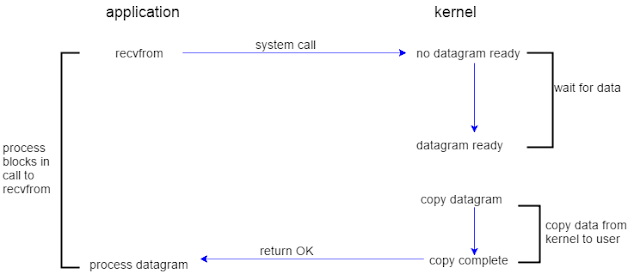
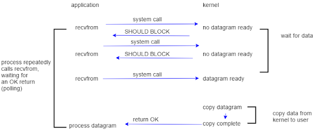
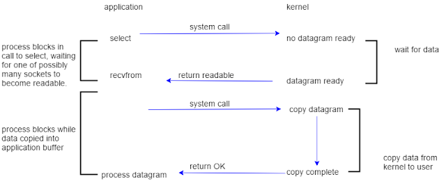
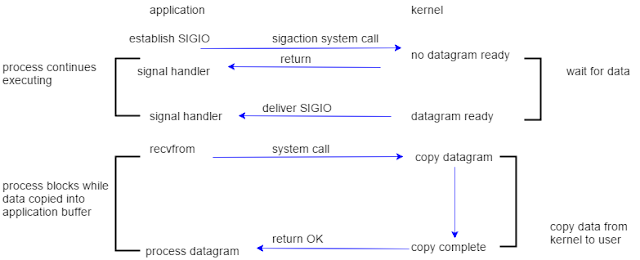

## 产生的背景
如果我们自己去设计一个服务端程序，是不是客户端请求，服务端拿到请求后，然后解析数据，业务处理，返回数据
如果客户端很少，那么我们服务端，一个一个处理可以
如果是多个客户端，那我们可以给每个客户端分配一个线程处理每个请求的
再或者，我们初始化一个线程池，去处理每个客户端的请求


## 5中IO模型
* 任何输入操作都有两个阶段 
  * 等待数据准备好
  * 将数据从内核复制到进程

### 阻塞 I/O
* 默认情况下,所有的io都是阻塞的
* 在应用程序中运行到在内核中运行并返回到应用程序有一个切换。

### 非阻塞 I/O
* 当我们将套接字设置为非阻塞时，我们告诉内核，如果我发出的 I/O 请求会使进程休眠，则返回错误而不是阻塞进程（让进程休眠）。

* 这种方法称为轮询。它通常会浪费 CPU 时间，但有时会在专用于一种功能的系统上使用。
### I/O 多路复用

### 信号驱动 I/O
* 信号可以告诉内核在描述符准备好时用 SIGIO 信号通知用户进程。


### 异步 I/O


## PPC


## TPC
* Thread Pre Connnection 含义：每次有新的连接就建立一个线程去专门处理这个连接的请求。
*  与PPC相比，线程更轻量级，创建的线程成本比进程要少的多，同时多线程是共享内存空间的，线程比进程的通信更简单

## Reactor
* 背景
  * PPC 模式最主要的问题就是每个连接都要创建进程（为了描述简洁，这里只以 PPC 和进程为例，实际上换成 TPC 和线程，原理是一样的），连接结束后进程就销毁了，这样做其实是很大的浪费。为了解决这个问题，一个自然而然的想法就是资源复用，即不再单独为每个连接创建进程，而是创建一个进程池，将连接分配给进程，一个进程可以处理多个连接的业务
  * 当一个连接一个进程时，进程可以采用“read -> 业务处理 -> write”的处理流程，如果当前连接没有数据可以读，则进程就阻塞在 read 操作上.
  * 如果一个进程处理多个连接，进程阻塞在某个连接的 read 操作上，此时即使其他连接有数据可读，进程也无法去处理，很显然这样是无法做到高性能的。
  * 解决这个问题的最简单的方式是将 read 操作改为非阻塞，然后进程不断地轮询多个连接。这种方式能够解决阻塞的问题，但解决的方式并不优雅。首先，轮询是要消耗 CPU 的；其次，如果一个进程处理几千上万的连接，则轮询的效率是很低的。
## 什么是IO多路复用
* 我们把标准输入、套接字都看成io的一路，任何io有事件发生的情况下,通知应用程序去处理响应的IO事件
* IO多路复用结合线程池，完美地解决了PPC和TPC的问题，而且大神们给他取了一个很牛的名字  reactor 反应堆。
* Reactor 模式也叫 Dispatcher 模式（在很多开源的系统里面会看到这个名称的类，其实就是实现 Reactor 模式的），更加贴近模式本身的含义，即 I/O 多路复用统一监听事件，收到事件后分配（Dispatch）给某个进程。
### IO多路复用技术归档的两个技术关键点:
* 当多条连接共用一个阻塞对象后，进程只需要在一个阻塞对象上等待，而无须再轮询所有连接，常见的实现方式有 select、epoll、kqueue 等。
* 当某条连接有新的数据可以处理时，操作系统会通知进程，进程从阻塞状态返回，开始进行业务处理。


### select 函数

int select(int maxfd, fd_set *readset, fd_set *writeset, fd_set *exceptset, const struct timeval *timeout);

返回：若有就绪描述符则为其数目，若超时则为0，若出错则为-1

## 同步阻塞网络IO
### 介绍
简称BIO
```
int main()
{
 int sk = socket(AF_INET, SOCK_STREAM, 0);
 connect(sk, ...)
 recv(sk, ...)
}
```
1.进程在 recv 的时候大概率会被阻塞掉，导致一次进程切换
2.当连接上数据就绪的时候进程又会被唤醒，又是一次进程切换
3.一个进程同时只能等待一条连接，如果有很多并发，则需要很多进程

## 例子
```

#include	"unp.h"

int
main(int argc, char **argv)
{
	int					sockfd, n;
	char				recvline[MAXLINE + 1];
	struct sockaddr_in	servaddr;

	if (argc != 2)
		err_quit("usage: a.out <IPaddress>");

	if ( (sockfd = socket(AF_INET, SOCK_STREAM, 0)) < 0)
		err_sys("socket error");

	bzero(&servaddr, sizeof(servaddr));
	servaddr.sin_family = AF_INET;
	servaddr.sin_port   = htons(13);	/* daytime server */
	if (inet_pton(AF_INET, argv[1], &servaddr.sin_addr) <= 0)
		err_quit("inet_pton error for %s", argv[1]);

	if (connect(sockfd, (SA *) &servaddr, sizeof(servaddr)) < 0)
		err_sys("connect error");

	while ( (n = read(sockfd, recvline, MAXLINE)) > 0) {
		recvline[n] = 0;	/* null terminate */
		if (fputs(recvline, stdout) == EOF)
			err_sys("fputs error");
	}
	if (n < 0)
		err_sys("read error");

	exit(0);
}

``` 


### select
```
#include <sys/select.h>

int select (int nfds, fd_set *readfds, fd_set *writefds,
            fd_set *exceptfds, struct timeval *timeout);
```

### poll
```
#include <poll.h>

struct pollfd {
    int   fd;         /* file descriptor */
    short events;     /* requested events */
    short revents;    /* returned events */
};         

int poll (struct pollfd *fds, nfds_t nfds, int timeout);

#define _GNU_SOURCE         
#include <signal.h>
#include <poll.h>

int ppoll (struct pollfd *fds, nfds_t nfds,
           const struct timespec *tmo_p, const sigset_t *sigmask);
```
### epoll

```
```


## 问题
1. linux操作系统，提供了三种网络编程模型  select poll epoll,
   1. 这三种模型都可以用来实现 I/O 多路复用，即同时监听多个文件描述符，以确定是否有数据可读写。它们都是基于事件驱动的编程模型，能够提高程序的并发性和性能。

下面简要介绍一下这三种模型的特点：
* select：是最古老的一种 I/O 多路复用模型，也是最常用的一种。它使用 fd_set 类型的数据结构来管理文件描述符集合，可以同时监听多个文件描述符的可读可写事件。但是，由于它使用的数据结构有一定的限制，每次调用 select 函数时需要重新初始化 fd_set 结构体，导致效率不够高。
* poll：是对 select 模型的改进，使用一个数组来管理文件描述符，可以同时监听更多的文件描述符。poll 的另一个优点是支持 edge-triggered 和 level-triggered 两种事件触发方式。但是，当文件描述符数量较大时，效率也不高。
* epoll：是最新的一种 I/O 多路复用模型，是在 Linux 内核 2.6 版本中引入的。它使用红黑树和双向链表来管理文件描述符，可以同时监听大量文件描述符的可读可写事件，并且效率非常高。
epoll 也支持 edge-triggered 和 level-triggered 两种事件触发方式。
因此，epoll 是目前最常用的一种 I/O 多路复用模型。

2. 他们之间的有什么关系，各自优缺点
3. redis、nginx为什么采用epoll


当涉及到 Linux 网络编程时，IO多路复用是一个非常重要的主题。它可以帮助我们更好地管理多个网络连接，同时减少资源消耗和提高程序性能。以下是一个更详细的关于IO多路复用的讲解：

I. IO多路复用简介
A. 什么是IO多路复用？
* IO多路复用（I/O multiplexing）是一种高效的I/O模型，通常用于在单个线程中管理多个I/O通道。它允许同时监视多个套接字，等待任何一个套接字准备好进行读写操作，从而减少了线程（或进程）数量，提高了系统性能和并发处理能力。
B. 为什么需要IO多路复用？
* IO多路复用的主要目的是为了提高系统的并发处理能力和效率，避免开启大量线程或进程来处理多个I/O操作的情况，从而降低系统的资源消耗和管理成本。通过IO多路复用，可以同时监视多个I/O通道的状态，一旦有就绪的I/O数据可读或可写，就立即进行相应的操作，提高了系统对于I/O数据的处理效率。此外，IO多路复用还可以支持非阻塞I/O操作，从而避免了长时间等待I/O完成的情况，提高了系统的响应速度和可靠性。
C. IO多路复用与传统的阻塞/非阻塞IO模型的对比

II. select函数
A. select函数的概述
B. select函数的使用方法和示例
C. select函数的局限性和缺点

III. poll函数
A. poll函数的概述
B. poll函数的使用方法和示例
C. poll函数的优点和缺点

IV. epoll函数
A. epoll函数的概述
B. epoll函数的使用方法和示例
C. epoll函数的优点和缺点

V. IO多路复用的实际应用
A. 并发服务器的实现
B. 客户端/服务器程序中的IO多路复用
C. IO多路复用的性能优化和调优

VI. 总结
A. IO多路复用的优势和适用场景
B. IO多路复用的缺点和不足
C. IO多路复用的未来发展趋势

IO多路复用是网络编程中的重要主题，可以帮助我们更好地管理网络连接，提高程序性能和资源利用率。掌握IO多路复用的概念和使用方法，有助于我们开发高效、可靠的网络应用程序。