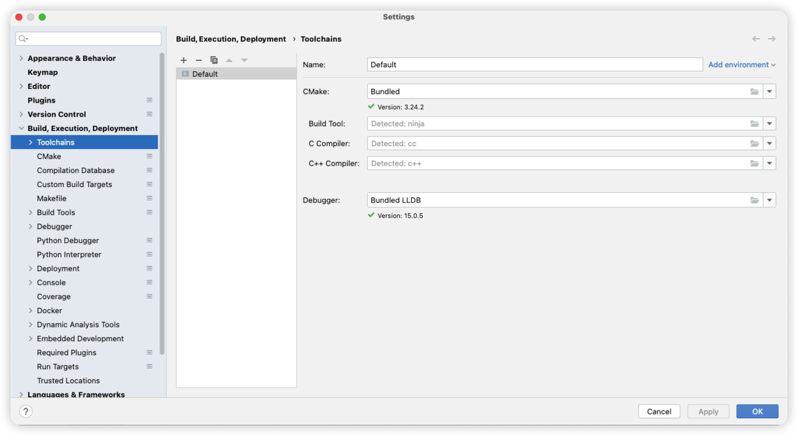
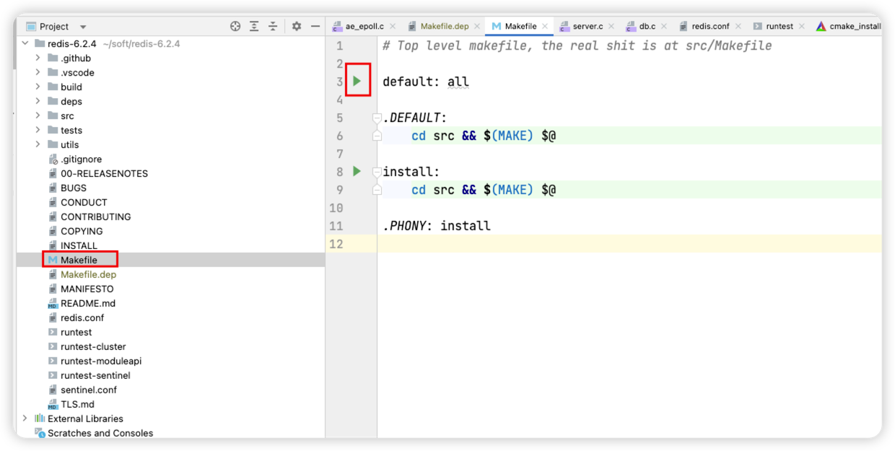
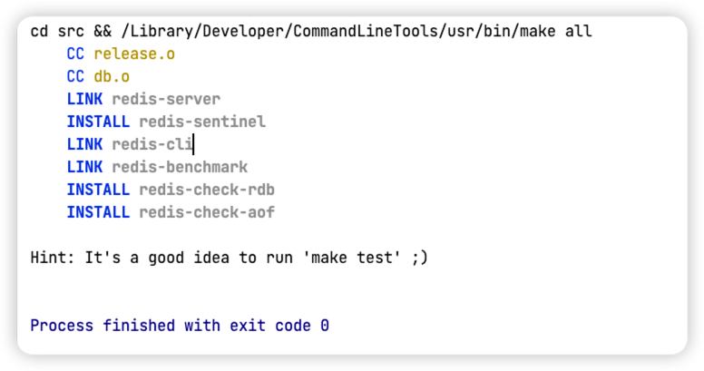
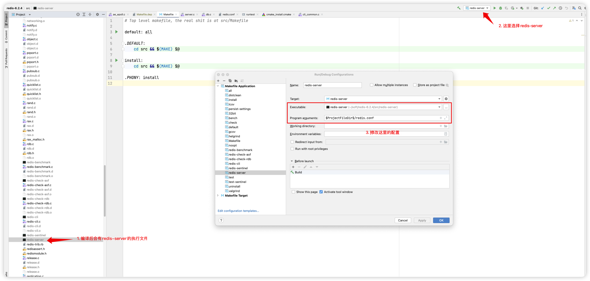
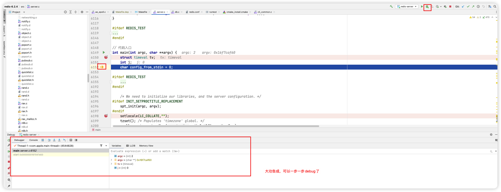

# mac环境下clion编译redis源码
## 准备环境的依赖

```
brew install gcc
xcode-select --install
```

* GCC 编译器是 Linux 系统下最常用的 C/C++ 编译器
* xcode-select是mac环境的一款完整的开发工具，用于开发macOS、iOS、watchOS和tvOS应用程序。
  

  
## 下载clion

```
https://www.jetbrains.com/clion/download/#section=mac
```

### 在clion 检查下环境是否有问题



## 下载redis源码
https://github.com/redis/redis.git


## 导入源码
略

## 执行markfile



* 执行成功
* 

## 配置


## 开始debug
