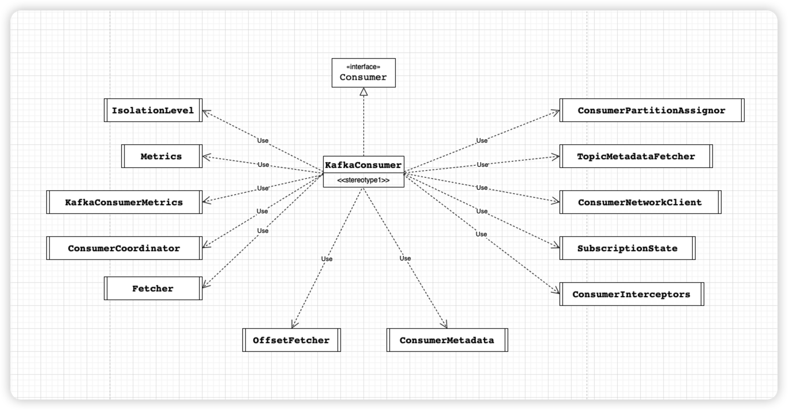

# 概述
KafkaConsumer是从Kafka服务端拉取消息的API，开发人员可以基于这套API轻松实现从Kafka服务端拉取消息的功能;
消费者是如何与Kafka服务端之间实现网络连接的管理、心跳检测、请求超时重试等功能
消费者是如何实现订阅Topic的分区数量、以及Consumer Group的重平衡、自动提交offset的功能。

我们从的三部分介绍KafkaConsumer的源码:
1. 消费者初始化(本文介绍)
2. 消费者如何拉取的数据的
3. 消费者是如何与协调者(ConsumerCoordinator)交互的

来分析上面的问题


# 名词解释
消费组:消费者组是一组消费者，它们合作消费来自某些主题的数据
offset:位移,Kafka服务端并不会记录消费者的消费位置， 而是由消费者自己决定如何保存如何记录其消费的offset。旧版本的消费者会将其消费位置记录到Zookeeper中，在新版本消贵者中为了缓解Zookeeper集群的压力，在Kafka服务端中添加了一个名为“consumer offsets”的内部Topic
分区重新分配:当消费者上下线都会触发消费组进行重平衡操作，对分区进行重新分配，待重平衡操作完后，消费者就可以读取offserts topic中的记录的offset，并从offset位置继续消费。

# 代码入口

```
public Consumer(final String topic,
                    final String groupId,
                    final Optional<String> instanceId,
                    final boolean readCommitted,
                    final int numMessageToConsume,
                    final CountDownLatch latch) {

        this.groupId = groupId;
        Properties props = new Properties();
        // 服务器地址和端口
        props.put(ConsumerConfig.BOOTSTRAP_SERVERS_CONFIG, KafkaProperties.KAFKA_SERVER_URL + ":" + KafkaProperties.KAFKA_SERVER_PORT);
        // 消费组id
        props.put(ConsumerConfig.GROUP_ID_CONFIG, groupId);
        instanceId.ifPresent(id -> props.put(ConsumerConfig.GROUP_INSTANCE_ID_CONFIG, id));
        // 自动提交偏移量,每次在调用KafkaConsumer.poll 方法时都会检测是否需要自动提交，并提交上次poll方法返回的最后 一个消息的offset
        props.put(ConsumerConfig.ENABLE_AUTO_COMMIT_CONFIG, "true");
        // 序列化
        props.put(ConsumerConfig.KEY_DESERIALIZER_CLASS_CONFIG, "org.apache.kafka.common.serialization.IntegerDeserializer");
        props.put(ConsumerConfig.VALUE_DESERIALIZER_CLASS_CONFIG, "org.apache.kafka.common.serialization.StringDeserializer");
        if (readCommitted) {
            props.put(ConsumerConfig.ISOLATION_LEVEL_CONFIG, "read_committed");
        }
        props.put(ConsumerConfig.AUTO_OFFSET_RESET_CONFIG, "earliest");
        //  重点1  这次重点分析这块 创建一个 KafkaConsumer 对象，这个对象负责与Kafka集群进行通信。
配置 KafkaConsumer 对象，包括指定Kafka集群的地址、消费者组ID、序列化器和反序列化器等参数。
        consumer = new KafkaConsumer<>(props);
        
    }

    public void run() {
        try {
            // 订阅一个或多个主题，通过调用 KafkaConsumer.subscribe() 方法并指定需要订阅的主题名称列表来实现。这个方法会发送一次订阅请求到Kafka集群，Kafka会返回订阅成功的主题列表。 
            consumer.subscribe(Collections.singletonList(this.topic), this);
            // 开始拉取数据。这个方法会向Kafka集群发送拉取请求，然后等待Kafka返回数据。返回的数据将被存储在内存中的缓冲区中，等待消费者处理。
            ConsumerRecords<Integer, String> records = consumer.poll(Duration.ofSeconds(1));
        }  catch (Exception e) {
            // 
        } finally {
            //shutdown();
        }
    }
```
* 说明
  * 消费者的参数配置:https://kafka.apache.org/documentation/#consumerconfigs
  * KEY_DESERIALIZER_CLASS_CONFIG 用于key的反序列化类，它被用来实现org.apache.kafka.common.serialization.Deserializer接口。
  * VALUE_DESERIALIZER_CLASS_CONFIG 用于value的反序列化类， 实现 org.apache.kafka.common.serialization.Deserializer 接口。
  * bootstrap.servers：它是用于与 Kafka 集群建立初始连接的主机和端口对的列表。
  * group.id：它是一个唯一的字符串，标识一个消费者组的消费者。
  

# 结构图




## 说明

* KafkaConsumer 实现了Consumer接口,Consumer接口有6个行为:
  * subscribe 方法:订阅指定的Topic，并为消费者自动分配分区。
  * assign0方法:用户手动订阅指定的Topic，并且指定消费的分区。此方法与 subscribeQ 方法互斥，在后面会详细介绍是如何实现互斥的。
  * commit 方法:提交消贵者已经消费完成的offset。
  * seek 方法:指定消费者起始消贵的位置。
  * poll 方法:负责从服务端获取消息。
  * pause、resume 方法:暂停/ 继续Consumer，暂停后poll0 方法会返回空。
* KafkaConsumerMetrics:消费端监控;
* ConsumerCoordinator:协调器管理,负责分配 Consumer 和 Partition 的对应关系，当 Partition 或是 Consumer 发生变更是，会触发 reblance（重新分配）过程，重新分配 Consumer 与 Partition 的对应关系；
* keyDeserializer:key反序列化;
* valueDeserializer:value反序列化;
* Fetcher:类的主要功能是发送 FetchRequest 请求，获取指定的消息集合，处理FeichResponse，更新消费位置
* OffsetFetcher:数据请求类;
* TopicMetadataFetcher:topic元数据拉取器;
* ConsumerInterceptors:消费者拦截器集合
* IsolationLevel:事务隔离级别
* ConsumerNetworkClient:消费者的网络客户端，负责消费者和集群中的各个Node节点之间的连接
* SubscriptionState:来跟踪TopicPartition和offset对应的关系
* ConsumerMetadata:记录消费者元数据;
* ConsumerPartitionAssignor:消费者分区分配策略;


# 构造方法

## 消费组的平衡配置类
```
// 消费组的平衡配置类
GroupRebalanceConfig groupRebalanceConfig = new GroupRebalanceConfig(config,  GroupRebalanceConfig.ProtocolType.CONSUMER);
this.groupId = Optional.ofNullable(groupRebalanceConfig.groupId);
```
* 初始化消费组的平衡配置类
* 获取消费组id

## 获取消费者客户端Id
```
this.clientId = config.getString(CommonClientConfigs.CLIENT_ID_CONFIG);
```
* 说明
  * 如果clientId为空则初始化默认的客户端Id:consumer-groupId-自增id
  ```
    String groupInstanceIdPart = groupInstanceId != null ? groupInstanceId : CONSUMER_CLIENT_ID_SEQUENCE.getAndIncrement() + "";
            String generatedClientId = String.format("consumer-%s-%s", groupId, groupInstanceIdPart);
            configs.put(CLIENT_ID_CONFIG, generatedClientId);
  ```
## 初始化日志

```
LogContext logContext;

// If group.instance.id is set, we will append it to the log context.
if (groupRebalanceConfig.groupInstanceId.isPresent()) {
    logContext = new LogContext("[Consumer instanceId=" + groupRebalanceConfig.groupInstanceId.get() +
            ", clientId=" + clientId + ", groupId=" + groupId.orElse("null") + "] ");
} else {
    logContext = new LogContext("[Consumer clientId=" + clientId + ", groupId=" + groupId.orElse("null") + "] ");
}

this.log = logContext.logger(getClass());
```

## 覆盖自动提交offset
```
boolean enableAutoCommit = config.maybeOverrideEnableAutoCommit();

boolean maybeOverrideEnableAutoCommit() {
    Optional<String> groupId = Optional.ofNullable(getString(CommonClientConfigs.GROUP_ID_CONFIG));
    boolean enableAutoCommit = getBoolean(ConsumerConfig.ENABLE_AUTO_COMMIT_CONFIG);
    if (!groupId.isPresent()) { // overwrite in case of default group id where the config is not explicitly provided
        if (!originals().containsKey(ENABLE_AUTO_COMMIT_CONFIG)) {
            enableAutoCommit = false;
        } else if (enableAutoCommit) {
            throw new InvalidConfigurationException(ConsumerConfig.ENABLE_AUTO_COMMIT_CONFIG + " cannot be set to true when default group id (null) is used.");
        }
    }
    return enableAutoCommit;
}

```
* 如果groupId为空并且没有配置了自动提交位移，则关闭自动提交，否则抛异常

## 配置了一堆超时时间和监控信息
```
// 请求超时时间
this.requestTimeoutMs = config.getInt(ConsumerConfig.REQUEST_TIMEOUT_MS_CONFIG);
this.defaultApiTimeoutMs = config.getInt(ConsumerConfig.DEFAULT_API_TIMEOUT_MS_CONFIG);
this.time = Time.SYSTEM;
this.metrics = buildMetrics(config, time, clientId);
this.retryBackoffMs = config.getLong(ConsumerConfig.RETRY_BACKOFF_MS_CONFIG);
```

##  拦截器
   ```    
List<ConsumerInterceptor<K, V>> interceptorList = (List) config.getConfiguredInstances(
            ConsumerConfig.INTERCEPTOR_CLASSES_CONFIG,
            ConsumerInterceptor.class,
            Collections.singletonMap(ConsumerConfig.CLIENT_ID_CONFIG, clientId));
    this.interceptors = new ConsumerInterceptors<>(interceptorList);

```
* 说明:
  * Consumerinterceptor.onConsumer 方法 可以 在消息通过poll 方法返回给用户之前对其进行拦截或修改;
  * Consumerinterceptor.onCommit方法也可以在服务端返回提交offset 成功的响应时对其进行拦截或修改;
  
## 序列化
```
if (keyDeserializer == null) {
    this.keyDeserializer = config.getConfiguredInstance(ConsumerConfig.KEY_DESERIALIZER_CLASS_CONFIG, Deserializer.class);
    this.keyDeserializer.configure(config.originals(Collections.singletonMap(ConsumerConfig.CLIENT_ID_CONFIG, clientId)), true);
} else {
    config.ignore(ConsumerConfig.KEY_DESERIALIZER_CLASS_CONFIG);
    this.keyDeserializer = keyDeserializer;
}
if (valueDeserializer == null) {
    this.valueDeserializer = config.getConfiguredInstance(ConsumerConfig.VALUE_DESERIALIZER_CLASS_CONFIG, Deserializer.class);
    this.valueDeserializer.configure(config.originals(Collections.singletonMap(ConsumerConfig.CLIENT_ID_CONFIG, clientId)), false);
} else {
    config.ignore(ConsumerConfig.VALUE_DESERIALIZER_CLASS_CONFIG);
    this.valueDeserializer = valueDeserializer;
}
```

## 位移重置的策略

```
  OffsetResetStrategy offsetResetStrategy = OffsetResetStrategy.valueOf(config.getString(ConsumerConfig.AUTO_OFFSET_RESET_CONFIG).toUpperCase(Locale.ROOT));
            this.subscriptions = new SubscriptionState(logContext, offsetResetStrategy);
```

## 集群资源监听器

```
ClusterResourceListeners clusterResourceListeners = configureClusterResourceListeners(this.keyDeserializer,
                    this.valueDeserializer, metrics.reporters(), interceptorList);
```

## 消费者的元数据
```
this.metadata = new ConsumerMetadata(retryBackoffMs,
                    config.getLong(ConsumerConfig.METADATA_MAX_AGE_CONFIG),
                    !config.getBoolean(ConsumerConfig.EXCLUDE_INTERNAL_TOPICS_CONFIG),
                    config.getBoolean(ConsumerConfig.ALLOW_AUTO_CREATE_TOPICS_CONFIG),
                    subscriptions, logContext, clusterResourceListeners);
```

## broker地址
```
List<InetSocketAddress> addresses = ClientUtils.parseAndValidateAddresses(
                    config.getList(ConsumerConfig.BOOTSTRAP_SERVERS_CONFIG), config.getString(ConsumerConfig.CLIENT_DNS_LOOKUP_CONFIG));
            this.metadata.bootstrap(addresses);
```

## ChannelBuilder、隔离级别以及心跳时间
```
 ChannelBuilder channelBuilder = ClientUtils.createChannelBuilder(config, time, logContext);
            this.isolationLevel = IsolationLevel.valueOf(
                    config.getString(ConsumerConfig.ISOLATION_LEVEL_CONFIG).toUpperCase(Locale.ROOT));
            int heartbeatIntervalMs = config.getInt(ConsumerConfig.HEARTBEAT_INTERVAL_MS_CONFIG);
```

## 网络通讯客户端

```
NetworkClient netClient = new NetworkClient(
                    new Selector(config.getLong(ConsumerConfig.CONNECTIONS_MAX_IDLE_MS_CONFIG), metrics, time, metricGrpPrefix, channelBuilder, logContext),
                    this.metadata,
                    clientId,
                    100, // a fixed large enough value will suffice for max in-flight requests
                    config.getLong(ConsumerConfig.RECONNECT_BACKOFF_MS_CONFIG),
                    config.getLong(ConsumerConfig.RECONNECT_BACKOFF_MAX_MS_CONFIG),
                    config.getInt(ConsumerConfig.SEND_BUFFER_CONFIG),
                    config.getInt(ConsumerConfig.RECEIVE_BUFFER_CONFIG),
                    config.getInt(ConsumerConfig.REQUEST_TIMEOUT_MS_CONFIG),
                    config.getLong(ConsumerConfig.SOCKET_CONNECTION_SETUP_TIMEOUT_MS_CONFIG),
                    config.getLong(ConsumerConfig.SOCKET_CONNECTION_SETUP_TIMEOUT_MAX_MS_CONFIG),
                    time,
                    true,
                    apiVersions,
                    fetchMetricsManager.throttleTimeSensor(),
                    logContext);
            this.client = new ConsumerNetworkClient(
                    logContext,
                    netClient,
                    metadata,
                    time,
                    retryBackoffMs,
                    config.getInt(ConsumerConfig.REQUEST_TIMEOUT_MS_CONFIG),
                    heartbeatIntervalMs);
```

## 消费者分区分配策略
```    
      this.assignors = ConsumerPartitionAssignor.getAssignorInstances(
                    config.getList(ConsumerConfig.PARTITION_ASSIGNMENT_STRATEGY_CONFIG),
                    config.originals(Collections.singletonMap(ConsumerConfig.CLIENT_ID_CONFIG, clientId))
            );
```

## 协调器
```
if (!groupId.isPresent()) {
                config.ignore(ConsumerConfig.AUTO_COMMIT_INTERVAL_MS_CONFIG);
                config.ignore(ConsumerConfig.THROW_ON_FETCH_STABLE_OFFSET_UNSUPPORTED);
                this.coordinator = null;
            } else {
                this.coordinator = new ConsumerCoordinator(groupRebalanceConfig,
                        logContext,
                        this.client,
                        assignors,
                        this.metadata,
                        this.subscriptions,
                        metrics,
                        metricGrpPrefix,
                        this.time,
                        enableAutoCommit,
                        config.getInt(ConsumerConfig.AUTO_COMMIT_INTERVAL_MS_CONFIG),
                        this.interceptors,
                        config.getBoolean(ConsumerConfig.THROW_ON_FETCH_STABLE_OFFSET_UNSUPPORTED),
                        config.getString(ConsumerConfig.CLIENT_RACK_CONFIG));
            }
```
## 抓取器(消息抓取、位移 以及元数据)

```
FetchConfig<K, V> fetchConfig = new FetchConfig<>(config,
                    this.keyDeserializer,
                    this.valueDeserializer,
                    isolationLevel);
            this.fetcher = new Fetcher<>(
                    logContext,
                    this.client,
                    this.metadata,
                    this.subscriptions,
                    fetchConfig,
                    fetchMetricsManager,
                    this.time);
            this.offsetFetcher = new OffsetFetcher(logContext,
                    client,
                    metadata,
                    subscriptions,
                    time,
                    retryBackoffMs,
                    requestTimeoutMs,
                    isolationLevel,
                    apiVersions);
            this.topicMetadataFetcher = new TopicMetadataFetcher(logContext, client, retryBackoffMs);

```


# 总结
* 掌握KafkaConsumer消费者都包含了哪些核心组件以及他们的职责
  * 依赖SubscriptionState管 理订阅的Topic 集合和Partition 的消费状态
  * 通过ConsumerCoordinator 与服务端的 GroupCoordinator 交互，完成Rebalance 操作并请求最近提交的offset
  * Fetcher 负责从 Kafka中拉取消息并进行解析，同时参与position 的重置操作，提供获取指定Topic的集群元数据的操作
  * 所有请求都是通过ConsumerNetworkClient 缓存并发送的