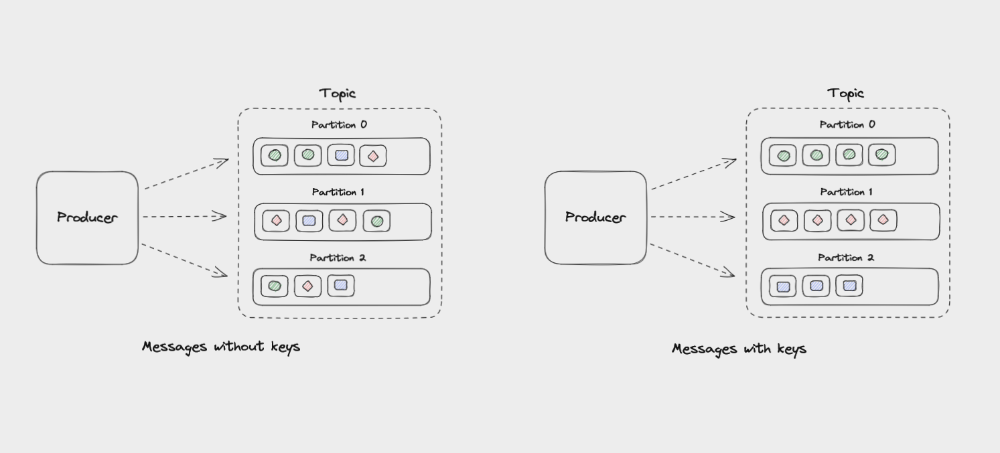

## 消费者分区

* Kafka 的消息组织方式实际上是三级结构：主题 - 分区 - 消息。
* 主题下的每条消息只会保存在某一个分区中，而不会在多个分区中被保存多份

### 为什么分区要这么设计呢
* 其实分区的作用就是提供负载均衡的能力，主要目的是为了提高kafka的高伸缩性

### 分区策略
所谓的分区策略其实就是生产者将消息发送到哪个分区的算法，kafka提供了默认的分区策略，也支持自定的分区策略

  * 轮询分区策略
    * 轮询策略有非常优秀的负载均衡表现，它总是能保证消息最大限度地被平均分配到所有分区上，故默认情况下它是最合理的分区策略，也是我们最常用的分区策略之一。
  * 随机策略
    * 随机就是我们随意地将消息放置到任意一个分区上
  * 按消息键保序策略
    * 一旦消息被定义了 Key，那么你就可以保证同一个 Key 的所有消息都进入到相同的分区里面，由于每个分区下的消息处理都是有顺序的，故这个策略被称为按消息键保序策略


## 引言
我们平常使用kafka发消息,那么kafka是怎么发送到broker，生产者内部都做哪些工作？
有哪些好的设计值得我们借鉴，我们带着这些问题，跟着kafka的生产者源码看看kafka是怎么设计的

0.10.2 的 Kafka 中，其 Client 端是由 Java 实现，Server 端是由 Scala 来实现的

## 例子

```

public class Producer {
    private final KafkaProducer<Integer, String> producer;
  
    public Producer(final String topic,
                    final String transactionalId,
                    final boolean enableIdempotency,
                    final int transactionTimeoutMs
                    ) {
        Properties props = new Properties();
        props.put(ProducerConfig.BOOTSTRAP_SERVERS_CONFIG, KafkaProperties.KAFKA_SERVER_URL + ":" + KafkaProperties.KAFKA_SERVER_PORT);
        props.put(ProducerConfig.CLIENT_ID_CONFIG, "DemoProducer");
        props.put(ProducerConfig.KEY_SERIALIZER_CLASS_CONFIG, IntegerSerializer.class.getName());
        props.put(ProducerConfig.VALUE_SERIALIZER_CLASS_CONFIG, StringSerializer.class.getName());
        if (transactionTimeoutMs > 0) {
            props.put(ProducerConfig.TRANSACTION_TIMEOUT_CONFIG, transactionTimeoutMs);
        }
        if (transactionalId != null) {
            props.put(ProducerConfig.TRANSACTIONAL_ID_CONFIG, transactionalId);
        }
        props.put(ProducerConfig.ENABLE_IDEMPOTENCE_CONFIG, enableIdempotency);
        producer = new KafkaProducer<>(props);
    }


    private void sendAsync(final int messageKey, final String messageStr, final long currentTimeMs) {
        this.producer.send(new ProducerRecord<>(topic,
                        messageKey,
                        messageStr),
                new DemoCallBack(currentTimeMs, messageKey, messageStr));
    }

}

class DemoCallBack implements Callback {

    private final long startTime;
    private final int key;
    private final String message;

    public DemoCallBack(long startTime, int key, String message) {
        this.startTime = startTime;
        this.key = key;
        this.message = message;
    }

    
    public void onCompletion(RecordMetadata metadata, Exception exception) {
        long elapsedTime = System.currentTimeMillis() - startTime;
        if (metadata != null) {
            System.out.println(
                "message(" + key + ", " + message + ") sent to partition(" + metadata.partition() +
                    "), " +
                    "offset(" + metadata.offset() + ") in " + elapsedTime + " ms");
        } else {
            exception.printStackTrace();
        }
    }
}

```

## KafkaProducer的构造方法

```
```
