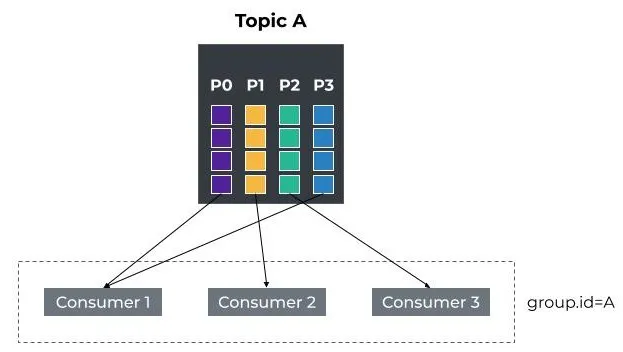

# Kafka重平衡的协议
## 引言
自从 Apache Kafka 2.3.0 版本以来，内部的 Rebalance Protocol（重新平衡协议）已经进行了几次重大更改，该协议特别用于 Kafka Connect 和消费者

## Kafka重平衡的协议
Apache Kafka是基于分布式发布/订阅模式的流处理平台。首先，被称为生产者的进程将消息发送到topic中，这些topic由一组broker管理和存储。然后，消费者的进程订阅这些topic以处理已发布的消息。

一个主题被分布在多个代理上，以便每个代理管理该主题的消息子集 - 这些子集称为分区。当创建一个主题时，可以定义分区的数量，并且随着时间的推移可以增加（但要小心进行此操作）

重要的是要理解，分区实际上是Kafka生产者和消费者的并行处理单位。

在生产者方面，分区允许并行写入消息。如果使用key发布消息，则默认情况下，生产者将哈希给定的key以确定目标分区。这提供了一个保证：所有具有相同key的消息都将发送到同一分区。此外，消费者将获得确保按该分区顺序传递消息的保证。

在消费者方面，主题的分区数限制了消费者组中活跃消费者的最大数量。消费者组是 Kafka 提供的一种机制，用于将多个消费者客户端分组到一个逻辑组中，以平衡分区的消费负载。 Kafka 保证topic分区仅分配给组中的一个消费者。

例如，下图描绘了一个名为 A 的消费者组，其中包含三个消费者。消费者订阅了主题 A，分区分配为：P0 到 C1，P1 到 C2，P2 到 C3 和 P1

 

如果消费者崩溃离开消费组，则其所有分区将在其他消费者之间自动重新分配。
同样，如果消费者（重新）加入现有组，则所有分区也将在组成员之间重新平衡。

通过使用所谓的 Kafka 再平衡协议，消费者客户端可以在动态组内进行合作。

让我们深入研究该协议以了解其工作原理。

## 再平衡协议
> Rebalance/Rebalancing：许多分布式进程遵循的过程，这些进程使用 Kafka 客户端和/或 Kafka 协调器形成一个公共组并在组成员之间分配一组资源（来源：Incremental Cooperative Rebalancing：支持和政策）

上面的这个定义实际上没有提到消费者或分区的概念。相反，它使用成员和资源的概念。这样做的主要原因是因为再平衡协议不仅限于管理消费者，还可以用于协调任何一组进程。

* 以下是协议重新平衡的一些用法：
  * 依靠重新平衡来选举领导节点。
  * Kafka Connect 使用它在worker之间分配任务和连接器
