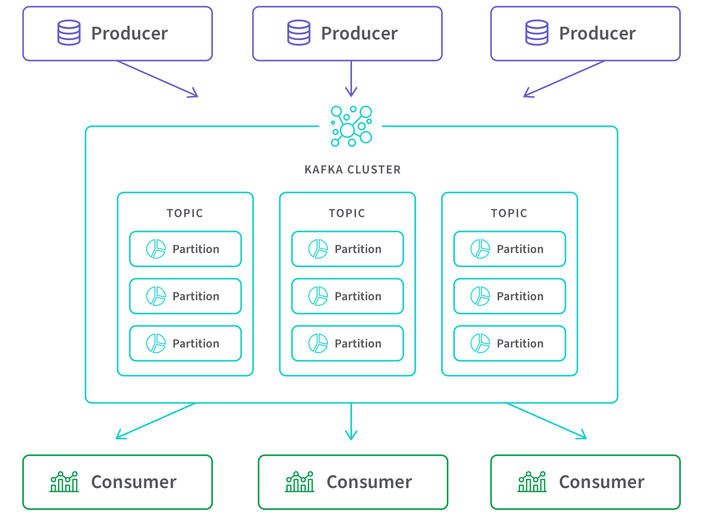
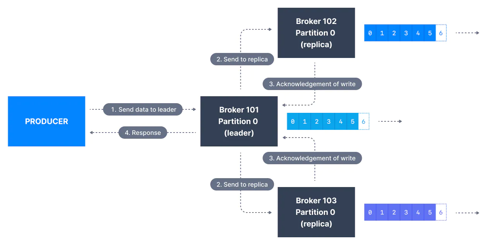
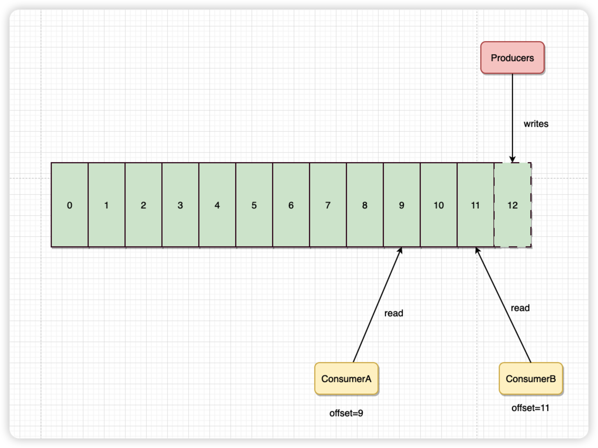

# 面试题:kafka如何保证消息不丢失
## 分析
Kafka 的整个架构非常简洁，主要由 Producer、Broker、Consumer 三部分组成，后面剖析丢失场景会从这三部分入手来剖析。

 


## 准备

* 已提交的信息
  * 当kafka的若干个broker成功接收到一个消息并写入到日志文件后，它们会告诉生产者程序这条消息已成功提交，此时这条消息变成“已提交”的消息

* 有限度的持久化保证
  * kafka不可能保证在任何情况下都做到不丢失消息， 
## 发送者
* 三种方式方式:
  * fire and forget（即发即弃生产者）
    * producer.send(msg),发送后忘记是最简单的方法。在这个方法中，我们向 broker 发送一条消息，并不关心它是否被成功接收
  * 同步
    ```
    try {
            RecordMetadata metadata = producer.send(record).get();
            System.out.println("Message is sent to Partition no " + metadata.partition() + " and offset " + metadata.offset());
        } catch (Exception e) {
            e.printStackTrace();
        } finally {
            producer.close();
        }
    ```
    * 在这种方法中，我们发送消息并等待直到我们得到响应。在成功的情况下，我们得到一个 RecordMetadata 对象，在失败的情况下，我们得到一个异常。大多数时候，我们不关心我们收到的成功和 RecordMetadata。我们只关心异常，因为我们想记录错误以供以后分析和采取适当的措施。如果您的消息很重要并且您不能丢失任何东西，则可以采用此方法。
    * 但重要的是要注意同步方法会减慢你的速度。它会限制您的吞吐量，因为您正在等待每条消息得到确认。您正在发送一条消息并等待成功，然后您发送下一条消息并再次等待成功。每条消息都需要一些时间才能通过网络传递。因此，在每条消息之后，您都会等待网络延迟，最有趣的是，如果成功，您可能什么都不做。你只关心失败，如果失败了，你可能想采取一些行动。
  * 异步回调
  
    ```
    public class AsynchronousProducer {

    public static void main(String[] args) throws Exception {
        String topicName = "AsynchronousProducerTopic";
        String key = "Key1";
        String value = "Value-1";

        Properties props = new Properties();
        props.put("bootstrap.servers", "localhost:9092,localhost:9093");
        props.put("key.serializer", "org.apache.kafka.common.serialization.StringSerializer");
        props.put("value.serializer", "org.apache.kafka.common.serialization.StringSerializer");

        Producer<String, String> producer = new KafkaProducer<>(props);
        ProducerRecord<String, String> record = new ProducerRecord<>(topicName, key, value);

        producer.send(record, new MyProducerCallback());
        System.out.println("AsynchronousProducer call completed");
        producer.close();

    }
}

class MyProducerCallback implements Callback {

    @Override
    public void onCompletion(RecordMetadata recordMetadata, Exception e) {
        if (e != null)
            System.out.println("AsynchronousProducer failed with an exception");
        else
            System.out.println("AsynchronousProducer call Success:");
    }
}
    ```

* 异步生产者的代码再次与发送后忘记方法相同。唯一的区别是发送方法有第二个参数。第二个参数是回调对象。
* 在这种方法中，您可以在不等待响应的情况下尽可能快地发送消息，并在故障出现后使用回调函数对其进行处理。
* Producer 永远要使用带有回调通知的发送 API，也就是说不要使用 producer.send(msg)，而要使用 producer.send(msg, callback)


* 设置 acks = all。acks 是 Producer 的一个参数，代表了你对“已提交”消息的定义。如果设置成 all，则表明所有副本 Broker 都要接收到消息，该消息才算是“已提交”。这是最高等级的“已提交”定义。
  
```
properties.setProperty(ProducerConfig.ACKS_CONFIG, "all");
```

  * 生产者可以选择接收数据写入的确认：
    * acks=0：生产者发送消息后不需要等待任何服务端的响应（可能会丢失数据）
    
    * acks=1：只有分区的leader的副本成功写入消息，就会收到来自服务端的成功响应
    
    * acks=all：需要等待isr中的所有副本都成功写入消息之后才能够收到来自服务端的成功响应（无数据丢失）
    

* 当生产者向代理发送消息时，代理可以返回成功或错误代码。这些错误代码属于两类。
    * 可重试的错误。重试后可以解决的错误。例如，如果代理返回异常 NotEnoughReplicasException ，生产者可以尝试再次发送消息——也许代理代理会重新上线并且第二次尝试会成功
    * 不可重试的错误。无法解决的错误。例如，如果代理返回 INVALID_CONFIG 异常，再次尝试相同的生产者请求将不会改变请求的结果。
    * 
    * 设置 retries 为一个较大的值。(Producer 的参数)，对应前面提到的 Producer 自动重试。
      * 当出现网络的瞬时抖动时，消息发送可能会失败，此时配置了 retries > 0 的 Producer 能够自动重试消息发送，避免消息丢失,另外注意，如果设置了retries参数，则建议设置max.in.flight.requests.per.connection=1，不然可能无法保证同一个分区的消息有序性。
    * 重试还和另一个参数retry.backoff.ms有关，这个参数的默认值为100，用来设定两次重试时间的间隔时间，避免无效的频繁重试。  


## broker
Broker 集群接收到数据后会将数据进行持久化存储到磁盘，为了提高吞吐量和性能，采用的是「异步批量刷盘的策略」，也就是说按照一定的消息量和间隔时间进行刷盘

* 设置 unclean.leader.election.enable = false。
  * 这个参数表示是否允许那些没有在ISR（in-sync-replicas）的broker有资格竞选分区leader。默认值为false，建议最好不要主动设置为true。因为如果没有在ISR集合中的副本，可能有些broker副本数据已经落后原先的leader太多了，一旦它成为新的leader副本，那必然出现消息的丢失。
* 
* 设置 replication.factor >= 3。
  * 其实这里想表述的是，最好将消息多保存几份，毕竟目前防止消息丢失的主要机制就是冗余。
  
* 设置 min.insync.replicas(最小同步副本) > 1。
  * 控制的是消息至少要被写入到多少个副本才算是“已提交”。设置成大于 1 可以提升消息持久性。在实际环境中千万不要使用默认值 1。
* 
* 确保 replication.factor > min.insync.replicas。
  * 如果两者相等，那么只要有一个副本挂机，整个分区就无法正常工作了。我们不仅要改善消息的持久性，防止数据丢失，还要在不降低可用性的基础上完成。推荐设置成 replication.factor = min.insync.replicas + 1。

## 消费端
* 消费者通过先消费消息再提交位移的数据给服务端做记录，这样即便消费者宕机，只要恢复后又能从正确的位置拉去数据进行消费，不至于造成消息丢失




* 确保消息消费完成再提交。Consumer 端有个参数 enable.auto.commit，最好把它设置成 false，并采用手动提交位移的方式。就像前面说的，这对于单 Consumer 多线程处理的场景而言是至关重要的。
