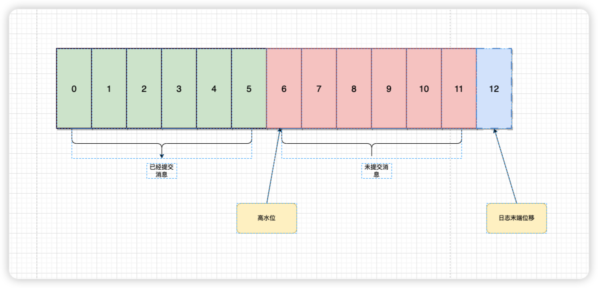

## 高水位作用
* 定义消息可见性，即用来标记分区下的哪些消息是可以被消费者消费的
* 帮助kafka完成副本同步

位移值等于高水位的消息也属于未提交消息。也就是说，高水位上的消息是不能被消费者消费的。

leo(log end offset) 是日志末端位移，它表示副本写入下一条消息的位移值——既分区中待写入消息的位置。这个位置和高水位之间的位置包括高水位的那个位置，就是所有未提交消息的全部位置所在啦——未提交的消息是不能被消费者消费的。所以，同一个副本对象，其高水位值不会大于 LEO 值。