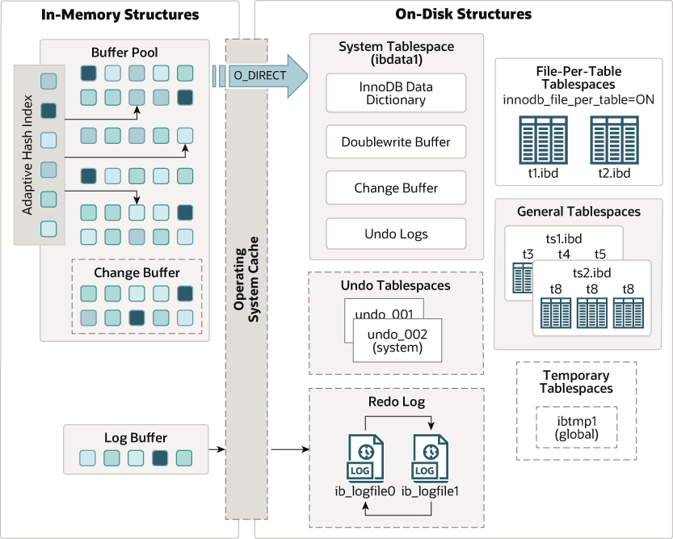

# 介绍
* InnoDB 是一个兼顾高可靠性和高性能的通用存储引擎。
* 在 MySQL 8.0 中， InnoDB 是默认的 MySQL 存储引擎。
* 除非您配置了不同的默认存​​储引擎，否则发出不带 ENGINE 子句的 CREATE TABLE 语句会创建一个 InnoDB 表。

# 优势
- 它的 DML 操作遵循 ACID 模型，事务具有提交、回滚和崩溃恢复功能以保护用户数据
- 行级锁定提高了多用户并发性和性能
- 每个 InnoDB 表都有一个称为聚簇索引的主键索引，它组织数据以最小化主键查找的 I/O
- 为了保持数据完整性， InnoDB 支持 FOREIGN KEY 约束。对于外键，检查插入、更新和删除以确保它们不会导致相关表之间的不一致。

# 结构图

# 好处
- 数据崩溃恢复：如果服务器由于硬件和软件的问题以外退出，无论当时数据库中发生了什么，您都不需要在重新启动数据库后执行任何特殊操作。 InnoDB 崩溃恢复会自动完成崩溃前提交的更改，并撤消正在进行但未提交的更改，允许您重新启动并从中断的地方继续。
- 维护自己缓存池:InnoDB 存储引擎维护自己的缓冲池，在访问数据时在主内存中缓存表和索引数据。经常使用的数据直接从内存中处理。此缓存适用于多种类型的信息并加快处理速度。在专用数据库服务器上，通常会将高达 80% 的物理内存分配给缓冲池
- 外键约束:如果将相关数据拆分到不同的表中，则可以设置外键来强制执行参照完整性
- 聚簇索引和二级索引：当您为每个表设计一个具有适当主键列的数据库时，涉及这些列的操作会自动优化。在 WHERE 子句、 ORDER BY 子句、 GROUP BY 子句和连接操作中引用主键列的速度非常快
- 更改缓冲区：插入、更新和删除通过称为更改缓冲的自动机制进行优化。 InnoDB 不仅允许对同一个表进行并发读写访问，它还缓存更改的数据以简化磁盘 I/O
- 自适应哈希索引：性能优势不仅限于具有长时间运行查询的大型表。当从表中反复访问相同的行时，自适应哈希索引会接管这些查找，使这些查找更快，就像它们来自哈希表一样
- InnoDB 表和页面压缩：压缩表和关联的索引
- InnoDB 静态数据加密：可以加密您的数据
- 在线 DDL 操作：可以创建和删除索引以及执行其他 DDL 操作，而对性能和可用性的影响要小得多
- File-Per-Table 表空间：截断 file-per-table 表空间非常快，可以释放磁盘空间供操作系统重用
- InnoDB 行格式：表格数据的存储布局对于 BLOB 和长文本字段更有效，采用 DYNAMIC 行格式
- InnoDB INFORMATION_SCHEMA 表：可以通过查询 INFORMATION_SCHEMA 表来监视存储引擎的内部工作
- InnoDB 与 MySQL 性能模式的集成：可以通过查询 Performance Schema 表来监控存储引擎的性能细节
  
# 最佳实践
- 为每个表指定一个主键，使用最常查询的列或多列，如果没有明显的主键，则使用自增值。
- 在从多个表中提取数据的情况下，请使用连接（join）。基于这些表中相同的ID值进行连接。为了获得快速的连接性能，请在连接列上定义外键，并在每个表中声明具有相同数据类型的列。添加外键可以确保引用列被索引，从而可以提高性能。外键还会将删除和更新传播到所有受影响的表，并防止在父表中不存在对应ID时向子表插入数据。
- 关闭自动提交。每秒提交数百次会限制性能（受存储设备写入速度的限制）
- 通过用 START TRANSACTION 和 COMMIT 语句将它们括起来，将相关 DML 操作集分组到事务中。虽然您不想过于频繁地提交，但您也不希望发出大量运行数小时而不提交的 INSERT 、 UPDATE 或 DELETE 语句。
- 不要使用LOCK TABLES语句。InnoDB可以处理多个会话同时读写同一张表，而不会牺牲可靠性或高性能。为了获得对一组行的独占写访问权限，请使用SELECT ... FOR UPDATE语法仅锁定您打算更新的行。
- 启用innodb_file_per_table变量或使用通用表空间将表的数据和索引放入单独的文件中，而不是系统表空间。 innodb_file_per_table变量默认已启用。
- 评估数据和访问模式是否受益于 InnoDB 表或页面压缩功能。可以在不牺牲读/写能力的情况下压缩 InnoDB 表。

