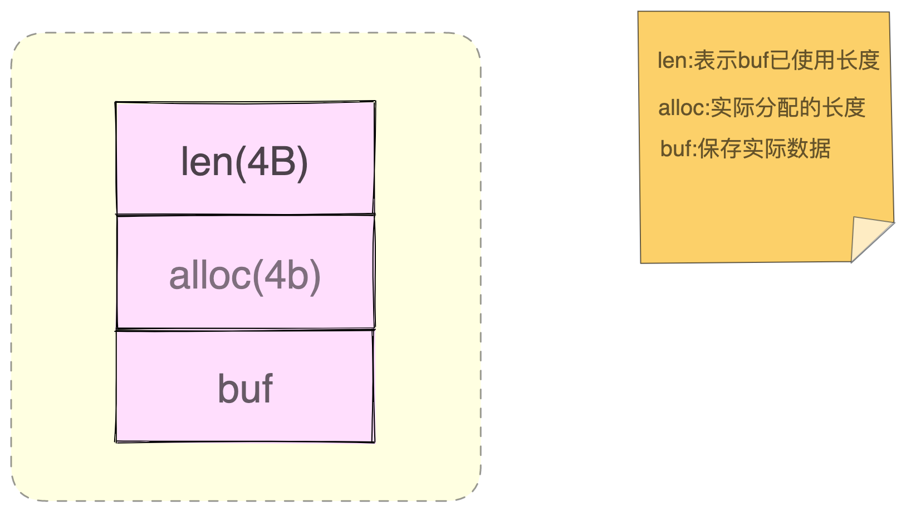

## string

### what
string可以保存二进制字节流，就像万金油一样，只要把数据转换成二进制字节数据，就可以保存了
string除了记录实际数据，string类型还需要额外的内存空间记录数据长度、空间使用等信息，这些信息也叫作元数据

### how

### why
#### string类型具体是怎么保存数据的呢？
* string采用简单动态字符串（sds）结构体来保存,sds结构如下:
  
  * buf是实际保存的数据
  * len和alloc是sds结构体的额外开销
* 除了sds的额外开销，还有一个来自redisObject结构体的开销
  * 为什么会有redisObject
    * 因为redis的数据类型有很多，不同类型都有相同的的元数据要记录（最后一次访问时间、被引用的次数），所以，redis会有一个redisObject结构体来统一记录这些元数据，同时指向实际的数据
    * redisObject包含8个字节的元数据和一个8字节的指针
  * 为了节省内存空间，redis对long类型整数和sds的内存布局做了专门的设计
    * 保存是long类型的整数是，redisObject中的指针就直接赋值为整数数据，这样就不用额外的指针再指向整数了，节省了指针的空间开销
    * 当保存的是字符串数据，并且字符串小于等于44个字符时，redisObject中的元数据、指针和SDS是一块连续的内存空间，这样就能避免内存碎片。这种布局方式也称为embstr编码方式
    * 当字符串大于44字节时，SDS的数据开始变多了，Redis就不再把SDS和RedisObject布局在一起了，而是会给SDS分配独立的空间，并用指针指向SDS结构，这种方式称为raw编码方式
  

### 了解下String类型的内存消耗的问题以及选择节省内存开销的数据类型的解决方案

string 类型就会用简单动态字符串(SDS):
* buf: 字节数组，保存实际数据
* len: 占4个字节，表示buf的已用长度
* alloc: 占4个字节，表示buf的实际分配长度

buf保存了实际数据，len和alloc本身其实是SDS结构体的额外开销
除了SDS的额外开销，还有一个来自于RedisObject结构体的开销
因为Redis的数据类型有很多，而且，不同的数据类型都有相同的元数据要记录（比如说最后一次访问的时间、被引用的次数等）
所以，Redis会用一个RedisObject结构体来统一记录这些元数据，同时指向实际数据。

一个RedisObject包含了8字节的元数据和一个8字节指针，这个指针再进一步指向具体数据类型的实际所在。
为了节省内存空间，Redis 还对 Long 类型整数和 SDS 的内存布局做了专门的设计。
一方面，当保存的是 Long 类型整数时，RedisObject 中的指针就直接赋值为整数数据了，这样就不用额外的指针再指向整数了，节省了指针的空间开销。
另一方面，当保存的是字符串数据，并且字符串小于等于 44 字节时，RedisObject 中的元数据、指针和 SDS 是一块连续的内存区域，这样就可以避免内存碎片。这种布局方式也被称为 embstr 编码方式。

当然，当字符串大于 44 字节时，SDS 的数据量就开始变多了，Redis 就不再把 SDS 和 RedisObject 布局在一起了，而是会给 SDS 分配独立的空间，并用指针指向 SDS 结构。这种布局方式被称为 raw 编码模式。

## 引起redis性能的5个因素
* redis内部的阻塞式操作
* cpu核和numa架构的影响
* redis关联系统配置
* redis内存碎片
* redis缓存区

## redis实例有哪些阻塞点
* 客户端：网络io，键值对增删改查操作、数据库的操作
* 磁盘：生成RDB快照、记录aof日志  aof日志重写
* 主从节点： 主从生成、传输rbd文件、从库接收rbd文件、清空数据库、加载rdb文件
* 切片集群实例： 向其他实例传入哈希槽信息、数据迁移

redis 会持久化保存数据到磁盘，这个过程要依赖文件系统来完成，所以文件系统将数据写回磁盘的机制，会直接影响到redis持久化的效率。
而且，在持久化的过程中，redis也还在接收其他请求，持久化的效率高低又会影响到redis处理请求的性能。

redis是内存数据库，内存操作非常频繁，所以操作的内存机制会直接影响到redis的处理效率；比如说，如果redis的内存不够用了，操作系统会启动
swap机制，这样会直接拖慢redis。

### redis碎片的问题
* 当数据删除后，redis释放的内存空间会由内存分配器管理，并不会立即返回给操作系统，所以操作系统仍然会记录着给redis分配了大量的内存。

* redis释放的内存空间可能并不是联系的，那么这些不连续的内存空间很有可能处于一种空闲的状态。这种就会导致一个问题：虽然有空闲空间，redis却无法用来保存数据，不仅会减少redis能够实际保存的数据量，还会降低redis的运行机器的成本回报率。

#### 内存碎片是如何形成的
* 内因，内存分配器的分配策略
  * redis可以使用libc、jemalloc、tcmalloc多种内存分配器来分配内存，默认是jemalloc

* 外因,键值对大小不一样和删除操作

### 如何判断碎片
使用info命令
mem_fragmentation_ratio = used_memory_rss/ used_memory;

active-defrag-ignore-bytes 100mb：表示内存碎片的字节数达到 100MB 时，开始清理；active-defrag-threshold-lower 10：表示内存碎片空间占操作系统分配给 Redis 的总空间比例达到 10% 时，开始清理。